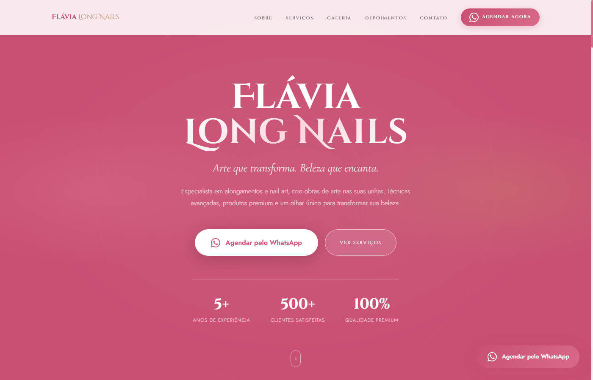

# Flávia Long Nails

Site institucional para uma especialista em alongamento de unhas e nail art — página única (one-page) com apresentação, galeria de trabalhos, serviços, depoimentos e agendamento direto pelo WhatsApp.

🔗 **Site no ar:** [erickkadr.github.io/Flavia-LongNails](https://erickkadr.github.io/Flavia-LongNails/)

## Prints

<div align="center">
  
  <br /><br />
  
</div>

## Sobre o projeto

Landing page para negócio local, pensada para converter visita em agendamento: apresentação da profissional, prova social (número de clientes, anos de experiência), galeria de trabalhos, cards de serviço e depoimentos — com o botão de WhatsApp sempre visível (fixo na tela) para o cliente marcar o horário sem fricção.

## Motivação

Projeto real de portfólio para uma cliente do ramo de estética — o objetivo era um site que **vendesse o serviço visualmente** (a galeria é o argumento de venda principal desse tipo de negócio) e que tornasse o agendamento o mais direto possível, sem formulário — direto pro WhatsApp.

## Funcionalidades

- **Hero** com estatísticas de credibilidade (anos de experiência, clientes atendidas, qualidade)
- **Galeria de trabalhos** em grade responsiva
- **Seção de serviços** com cards (alongamento, nail art, spa dos pés etc.)
- **Depoimentos** de clientes
- **Botão de WhatsApp flutuante**, sempre visível, além de vários CTAs ao longo da página
- **Menu fixo (sticky)** que muda de estilo ao rolar a página
- **Menu mobile** responsivo
- **Animações de entrada (scroll reveal)** conforme o usuário rola a página

## Tecnologias

- **HTML5**
- **CSS3** (layout responsivo, animações, sticky header)
- **JavaScript** (IntersectionObserver para scroll reveal, menu mobile, header dinâmico)

## Como rodar localmente

Sem build, sem dependência — abra `index.html` no navegador ou sirva a pasta:

```bash
npx serve .
```

---

### Made with ♥ by Erick Dantas | [Contato](https://www.linkedin.com/in/erickkadr/)
